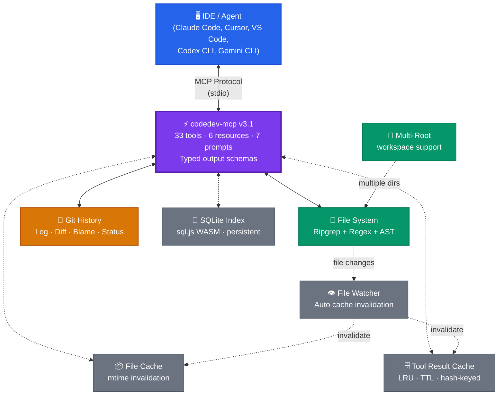

# codedev-mcp

**Universal code development MCP server** — search, analyze, review, and navigate any codebase across 40+ programming languages. 33 tools, semantic search, AST parsing, security scanning, dead code detection, complexity heatmaps, type flow analysis, database schema parsing, API contract discovery, IaC analysis, CI/CD pipeline parsing, monorepo support, dependency vulnerability scanning, performance profiling, code scaffolding, and more. Works with every MCP-compatible IDE. **Zero API keys needed.**

The host LLM (Claude, GPT, Gemini) does the reasoning. This server gives it **fast, structured, comprehensive access** to your code.



> **100% local execution. No data leaves your machine. No API keys. No network calls.**

## Why?

| Problem | codedev-mcp solves it |
|---|---|
| AI can't search your codebase efficiently | Ripgrep-powered search + TF-IDF semantic search |
| AI doesn't understand your project structure | `codebase_map` gives full overview in one call |
| AI loses context in large codebases | Symbol search, call graphs, dependency maps, targeted file reading |
| No visibility into code quality | Security scan, test coverage, doc extraction, health checks |
| Hard to assess change impact | `change_impact` finds affected files, tests, and breaking changes |
| Different tools for different IDEs | One server works everywhere — Claude Code, Cursor, VS Code, Codex, Gemini CLI |
| Needs API keys / external services | Zero config, runs 100% local, no network required |

## Tools (33)

### Search & Navigation
| Tool | Description |
|---|---|
| `search_code` | Fast text/regex search across the codebase (ripgrep-powered) |
| `search_symbols` | Find functions, classes, types, interfaces by name or pattern |
| `semantic_search` | **Concept-based search** — find "authentication logic" or "error handling code" without exact strings |
| `find_references` | Find all usages of a symbol across the codebase |
| `file_tree` | Smart directory listing with depth control and filtering |
| `context_pack` | **Smart context packing** — returns the most relevant files/snippets for a question within a token budget |

### Analysis & Architecture
| Tool | Description |
|---|---|
| `codebase_map` | Full project overview: languages, frameworks, structure, git info |
| `analyze_file` | Deep file analysis: symbols, imports, exports, complexity |
| `read_files` | Read one or multiple files with line ranges (consolidated single/batch) |
| `dependency_graph` | Import/dependency relationship analysis for any file |
| `call_graph` | **Function call relationships** — who calls what (tree-sitter AST or regex) |
| `code_metrics` | LOC, complexity, comment ratios, file size analysis |
| `type_flow` | **Type flow analysis** — trace where a type/interface flows: definition → imports → params → returns |
| `architecture_check` | **Layer boundary enforcement** — verify controllers don't import from repositories, etc. |
| `complexity_heatmap` | **Complexity ranking** — rank files/functions by cyclomatic, cognitive, nesting metrics |

### Quality & Security
| Tool | Description |
|---|---|
| `security_scan` | **SAST-lite** — detects SQL injection, XSS, hardcoded secrets, eval, weak crypto, path traversal (15 patterns) |
| `test_coverage` | Parse lcov/istanbul/cobertura — coverage percentages, uncovered lines, untested functions |
| `code_docs` | Extract JSDoc, Python docstrings, Rustdoc, Javadoc, Go doc comments; find undocumented APIs |
| `find_pattern` | Detect TODOs, large files, long functions, hardcoded secrets, empty catches, console logs |
| `dead_code` | **Dead code detection** — unused exports, orphan files never imported |
| `dep_vuln_scan` | **Dependency vulnerability scanning** — cross-references lock files against bundled offline advisory database (no network calls) |

### Performance
| Tool | Description |
|---|---|
| `perf_profile` | **Performance profiling** — V8 CPU profiles, webpack bundle stats, large files, heavy npm deps with lighter alternatives |

### Git & Change Management
| Tool | Description |
|---|---|
| `git_history` | Log, diff, blame, status, branches, contributors, show commits |
| `change_impact` | **Impact analysis** — given changes, find affected dependents, tests to re-run, breaking changes, risk level |
| `branch_compare` | **Branch structural diff** — added/modified/deleted files, commits ahead/behind, conflict detection |
| `git_hooks` | **Pre-commit hooks** — generate, preview, or check status of git hooks for code quality enforcement |

### Infrastructure & Ecosystem
| Tool | Description |
|---|---|
| `db_schema` | **Database schema analysis** — Prisma, Drizzle, SQLAlchemy, Django ORM, TypeORM, raw SQL DDL |
| `api_contracts` | **API endpoint discovery** — OpenAPI/Swagger, GraphQL, Express, NestJS, FastAPI route parsing |
| `iac_analyze` | **Infrastructure-as-Code** — Terraform, CloudFormation, Kubernetes manifests, Docker Compose |
| `cicd_analyze` | **CI/CD pipeline parsing** — GitHub Actions, GitLab CI, Jenkins, CircleCI |
| `monorepo_analyze` | **Monorepo intelligence** — npm/yarn/pnpm workspaces, Cargo, Lerna, Nx, Turborepo |

### Code Generation
| Tool | Description |
|---|---|
| `scaffold` | **Boilerplate generation** — auto-detects project conventions and generates components, routes, tests, services, hooks, utils |

### Notebooks
| Tool | Description |
|---|---|
| `notebook_analyze` | Jupyter .ipynb analysis — code cells, execution order, imports, health scoring |

## MCP Resources (6)

Auto-loaded context available without tool calls:

| Resource URI | Description |
|---|---|
| `project://config` | Project config files (package.json, tsconfig, pyproject.toml, Cargo.toml, etc.) |
| `project://structure` | Directory tree (top 3 levels, cached) |
| `project://gitinfo` | Current branch, recent commits, dirty files |
| `project://languages` | Language breakdown with file counts |
| `server://stats` | **Server analytics** — uptime, per-tool call counts, avg/max duration, error rates, file cache + tool-result cache hit ratios |
| `project://suggested_actions` | **AI-suggested next actions** — recommends unused tools and flags issues based on usage patterns |

## MCP Prompts (7)

Workflow macros that chain multiple tools for common tasks:

| Prompt | Description | Tools Chained |
|---|---|---|
| `onboard_codebase` | Complete project onboarding overview | codebase_map → file_tree → code_metrics → dependency_graph → git_history → find_pattern |
| `review_changes` | Pre-commit code review | git_history → change_impact → find_pattern × 3 → security_scan |
| `investigate_symbol` | Deep-dive into any function/class | search_symbols → find_references → code_docs → dependency_graph → call_graph → git_history |
| `code_health_check` | Full codebase health audit | code_metrics → find_pattern × 4 → security_scan → test_coverage |
| `understand_file` | Complete file understanding | analyze_file → read_files → code_docs → dependency_graph → call_graph → git_history → test_coverage |
| `pr_review` | **PR review workflow** | branch_compare → analyze_file → complexity_heatmap → security_scan → dead_code → test_coverage → architecture_check |
| `refactor_plan` | **Refactoring priority plan** | complexity_heatmap → dead_code → architecture_check → security_scan → code_docs → test_coverage → find_pattern |

## Language Support

**Full analysis support** (symbols, imports, docs, call graphs, security patterns) for:

TypeScript, JavaScript, Python, Java, Go, Rust, C, C++, C#, Ruby, PHP, Swift, Kotlin

**Search + symbol detection** (regex-based extraction) for:

Dart, Scala, Elixir, Erlang, Haskell, OCaml, F#, Lua, R, Julia, Perl, Shell/Bash, Clojure, Zig, Nim, Crystal, V

**Search-only** (text search, file detection, metrics — no deep symbol extraction):

SQL, Solidity, Terraform, YAML, TOML, Markdown, HTML, CSS, SCSS, Vue, Svelte, and any other text file

> **Note**: `security_scan` runs SAST patterns against TS, JS, Python, Java, Go, Rust, Ruby, PHP, and C#. Use `search_code` with regex patterns for security checks in other languages.

## Prerequisites

- **Node.js v18+** — required ([download](https://nodejs.org/))
- **Git** — must be in your `PATH` for git_history, change_impact, and git-related features
- **ripgrep** (optional, recommended) — 10-100x faster search; falls back to grep if not installed ([install](https://github.com/BurntSushi/ripgrep#installation))

Verify:
```bash
node --version   # v18.0.0 or higher
git --version    # any recent version
rg --version     # optional but recommended
```

## Installation

### Claude Code
```bash
claude mcp add codedev -- npx -y codedev-mcp
```

### Codex CLI
Add to `~/.codex/config.toml`:
```toml
[mcp_servers.codedev]
command = "npx"
args = ["-y", "codedev-mcp"]
```

### Gemini CLI
Add to `~/.gemini/settings.json`:
```json
{
  "mcpServers": {
    "codedev": {
      "command": "npx",
      "args": ["-y", "codedev-mcp"]
    }
  }
}
```
> **Note**: If Gemini CLI can't find `npx`, use the full path: `"command": "/usr/local/bin/npx"` (run `which npx` to find yours). On Windows, use `npx.cmd` or the full path from `where npx`.

### Cursor
Add to `~/.cursor/mcp.json`:
```json
{
  "mcpServers": {
    "codedev": {
      "command": "npx",
      "args": ["-y", "codedev-mcp"]
    }
  }
}
```

### VS Code / GitHub Copilot
Command Palette → "MCP: Add Server", or add to `.vscode/settings.json`:
```json
{
  "mcp": {
    "servers": {
      "codedev": {
        "command": "npx",
        "args": ["-y", "codedev-mcp"]
      }
    }
  }
}
```

### Windsurf
Add to MCP configuration:
```json
{
  "mcpServers": {
    "codedev": {
      "command": "npx",
      "args": ["-y", "codedev-mcp"]
    }
  }
}
```

### Claude Desktop
Add to `claude_desktop_config.json`:
```json
{
  "mcpServers": {
    "codedev": {
      "command": "npx",
      "args": ["-y", "codedev-mcp"]
    }
  }
}
```

### Docker
```bash
docker build -t codedev-mcp .
docker run --init -i -v /path/to/project:/workspace:ro codedev-mcp
```

Or with docker-compose:
```bash
PROJECT_DIR=/path/to/project docker-compose up
```

### Version Pinning

`npx -y codedev-mcp` always fetches the latest version. For stability in CI/CD or team environments, pin a version:

```bash
npx -y codedev-mcp@3.1.0
```

Or install globally:
```bash
npm install -g codedev-mcp@3.1.0
```

## Working Directory

By default, codedev-mcp uses the current working directory. Override with:

```bash
# Environment variable
CODEDEV_CWD=/path/to/project npx codedev-mcp

# CLI flag
npx codedev-mcp --cwd=/path/to/project

# In MCP config (any IDE)
{
  "command": "npx",
  "args": ["-y", "codedev-mcp", "--cwd=/path/to/your/project"]
}
```

### Multi-Root Workspaces

Analyze multiple project directories simultaneously with `--roots`:

```bash
# CLI flag (comma-separated)
npx codedev-mcp --roots=/path/to/frontend,/path/to/backend,/path/to/shared

# Environment variable
CODEDEV_ROOTS=/path/to/frontend,/path/to/backend npx codedev-mcp

# In MCP config
{
  "command": "npx",
  "args": ["-y", "codedev-mcp", "--roots=/path/to/frontend,/path/to/backend"]
}
```

When multi-root is enabled, tools like `search_code` and `codebase_map` automatically span all roots, prefixing results with the root directory name. The file watcher monitors all roots for cache invalidation. Single-root mode (`--cwd`) remains the default and is fully backward-compatible.

## Configuration & Filtering

### .gitignore Support

**Ripgrep respects `.gitignore` automatically.** When ripgrep is installed, `search_code` and `find_references` will skip files listed in your `.gitignore`, `.rgignore`, and `.ignore` files by default. This is a built-in ripgrep behavior — no configuration needed.

When falling back to grep (ripgrep not installed), codedev-mcp uses a hardcoded exclusion list instead.

### Default Exclusions

All tools automatically exclude these directories, even without a `.gitignore`:

```
node_modules, .git, dist, build, __pycache__, .venv, venv,
target, bin, obj, .next, coverage, vendor, Pods, .dart_tool
```

### Custom Filtering

Most tools accept `file_glob` or `directory` parameters for targeted analysis:

```
"Find TODO comments only in Python files"
→ find_pattern with file_glob: "*.py"

"Search only in the src/api directory"
→ search_code with directory: "src/api"

"Analyze only Go files for security issues"
→ security_scan with file_glob: "**/*.go"
```

For batch reads, `max_lines_per_file` (default: 200) prevents overwhelming output from large files.

> **No `--ignore` CLI flag exists currently.** Custom exclusions beyond `.gitignore` should be handled via `file_glob` and `directory` parameters on individual tool calls. Plugin support allows adding custom exclusion logic if needed.

## Usage Examples

Once installed, just talk to your AI naturally:

> **"Map out this codebase for me"**
> → AI calls `codebase_map`

> **"Find all authentication-related code"**
> → AI calls `semantic_search` with query "authentication"

> **"Who calls the handlePayment function?"**
> → AI calls `call_graph` with function_name "handlePayment"

> **"Run a security scan"**
> → AI calls `security_scan`

> **"What's the test coverage for src/auth/login.ts?"**
> → AI calls `test_coverage` with action "file"

> **"Show me the docs for the UserService class"**
> → AI calls `code_docs` with action "extract" and symbol "UserService"

> **"What would be affected if I change src/api/routes.ts?"**
> → AI calls `change_impact` with files ["src/api/routes.ts"]

> **"Do a full code review before I commit"**
> → AI uses the `review_changes` prompt (chains 7 tools)

> **"Give me a health check of this codebase"**
> → AI uses the `code_health_check` prompt (chains 8 tools)

> **"Analyze this Jupyter notebook"**
> → AI calls `notebook_analyze` with action "analyze"

> **"What changed in the last 5 commits?"**
> → AI calls `git_history` with action "log" and with_files true

> **"Find dead code and unused exports"**
> → AI calls `dead_code`

> **"What are the most complex files that need refactoring?"**
> → AI calls `complexity_heatmap` with granularity "file"

> **"Compare my feature branch against main"**
> → AI calls `branch_compare` with base "main"

> **"Where does the UserProfile type flow through the codebase?"**
> → AI calls `type_flow` with type_name "UserProfile"

> **"Check for architecture violations"**
> → AI calls `architecture_check`

> **"Show me the database schema"**
> → AI calls `db_schema`

> **"Find all API endpoints in this project"**
> → AI calls `api_contracts`

> **"Analyze the CI/CD pipelines"**
> → AI calls `cicd_analyze`

> **"What Terraform resources are defined?"**
> → AI calls `iac_analyze`

> **"Analyze the monorepo structure"**
> → AI calls `monorepo_analyze`

> **"Review this PR thoroughly"**
> → AI uses the `pr_review` prompt (chains 7 tools)

> **"Create a refactoring plan for technical debt"**
> → AI uses the `refactor_plan` prompt (chains 7 tools)

> **"Get me the most relevant files for understanding the auth flow"**
> → AI calls `context_pack` with query "authentication flow"

> **"Scan dependencies for vulnerabilities"**
> → AI calls `dep_vuln_scan`

> **"Are there any performance bottlenecks?"**
> → AI calls `perf_profile`

> **"Generate a React component following our conventions"**
> → AI calls `scaffold` with action "generate" and template "component"

> **"Set up a pre-commit hook"**
> → AI calls `git_hooks` with action "generate"

## Output Examples

### `change_impact` output

```
## Change Impact Analysis

3 files changed, 2 symbols modified
8 dependent files affected
2 test files need re-running
⚠️ 1 breaking changes detected
Risk level: CRITICAL

### Changed symbols:
  modified: handlePayment in src/billing/payments.ts
  removed: legacyCharge in src/billing/payments.ts

### Affected files (8):
  src/api/routes.ts
  src/checkout/flow.ts
  src/webhooks/stripe.ts
  ...

### Tests to re-run (2):
  tests/billing/payments.test.ts
  tests/api/routes.test.ts

### ⚠️ Breaking changes:
  Removed: legacyCharge from src/billing/payments.ts
```

### `security_scan` output

```
## Security Scan Report

Total findings: 4
Severity breakdown: critical: 1, high: 2, medium: 1

Dependencies: 12 direct, 347 total (lockfile ✅)

### Findings:

🔴 [CRITICAL] Hardcoded secret/credential
   src/config/database.ts:14
   const DB_PASSWORD = "super_secret_123"
   💡 Move secrets to environment variables or a secret manager.

🟠 [HIGH] Potential XSS via innerHTML
   src/components/render.ts:42
   element.innerHTML = userInput
   💡 Use textContent instead of innerHTML, or sanitize with DOMPurify.
```

### `test_coverage` output

```
## Test Coverage (lcov)

Files: 47
Lines: 2,841/4,120 (68%)
Functions: 189/267 (70%)
Branches: 412/680 (60%)

### Lowest coverage files:
  src/billing/payments.ts              23% lines   20% funcs
  src/api/middleware.ts                 34% lines   25% funcs
  src/utils/crypto.ts                  41% lines   33% funcs
```

## Performance

- **Search**: Ripgrep-powered, handles 100K+ file codebases in < 1 second
- **Two-tier caching**: File-level mtime cache + tool-result LRU cache (2,000 entries, 120s TTL) — repeated tool calls return instantly
- **SQLite persistent index**: sql.js WASM-based SQLite stores file/symbol/import indices across restarts — no re-indexing on startup
- **File watching**: Automatic cache invalidation when files change (chokidar) — invalidates both file cache and tool-result cache
- **Multi-root workspaces**: Analyze multiple project directories in a single session with `--roots=dir1,dir2`
- **AST parsing**: Tree-sitter WASM when available, regex fallback for all languages
- **Smart filtering**: Respects `.gitignore`, auto-excludes build dirs, configurable via `file_glob`
- **Large file protection**: Batch reads truncate at 200 lines/file by default (configurable); line-range reading for targeted access
- **No network**: Everything runs locally, zero latency from API calls

## Architecture

```
src/
├── index.ts                    # MCP server: 33 tools, 6 resources, 7 prompts (~2,326 lines)
├── schemas/
│   └── output-schemas.ts       # Zod output schemas for all 33 tools (typed structuredContent)
├── search/
│   ├── fast-search.ts          # Ripgrep/grep search engine
│   └── semantic.ts             # TF-IDF semantic search with synonym expansion
├── analyzers/
│   ├── symbols.ts              # Symbol extraction (40+ languages)
│   ├── codebase.ts             # Codebase mapping & metrics
│   ├── git.ts                  # Git operations (log, diff, blame, status)
│   ├── tree-sitter.ts          # AST parsing, call graphs, scope analysis
│   ├── coverage.ts             # Test coverage (lcov, istanbul, cobertura)
│   ├── docs.ts                 # Documentation extraction (JSDoc, docstrings, etc.)
│   ├── security.ts             # SAST-lite security scanning (15 patterns)
│   ├── impact.ts               # Change impact analysis
│   ├── notebook.ts             # Jupyter notebook parsing
│   ├── dead-code.ts            # Dead code detection (unused exports, orphan files)
│   ├── branch-compare.ts       # Structural git branch comparison
│   ├── complexity-heatmap.ts   # Complexity ranking with A-F grading
│   ├── context-pack.ts         # Smart context window packing
│   ├── type-flow.ts            # Type/interface flow tracing
│   ├── architecture.ts         # Layer boundary rule enforcement
│   ├── db-schema.ts            # Database schema parsing (6 ORMs + raw SQL)
│   ├── api-contract.ts         # API endpoint discovery (REST, GraphQL, tRPC)
│   ├── iac.ts                  # Infrastructure-as-Code analysis
│   ├── cicd.ts                 # CI/CD pipeline parsing
│   ├── monorepo.ts             # Monorepo workspace intelligence
│   ├── dep-vuln.ts             # Dependency vulnerability scanning
│   ├── perf-profile.ts         # Performance profiling & bundle analysis
│   └── scaffold.ts             # Code generation from project conventions
├── cache/
│   └── memory-cache.ts         # File cache (mtime) + tool-result LRU cache (2K entries, 120s TTL)
├── db/
│   ├── json-store.ts           # JSON-file persistent index (legacy)
│   └── sqlite-store.ts         # SQLite persistent index (sql.js WASM, zero native deps)
├── types/
│   └── sql.js.d.ts             # Type declarations for sql.js WASM module
└── utils/
    ├── languages.ts            # Language detection & patterns (40+)
    ├── plugins.ts              # Plugin architecture + npm marketplace auto-discovery
    ├── analytics.ts            # Per-tool usage analytics & tracking
    └── git-hooks.ts            # Git hook generation & management

Dockerfile                      # Multi-stage Docker build (alpine, non-root, tini)
docker-compose.yml              # Docker Compose for easy deployment
```

**~10,200 lines of TypeScript** across 36 source files. 7 runtime dependencies.

## Plugins

Extend codedev-mcp with custom analyzers without forking:

### Local Plugins

```
~/.codedev-mcp/plugins/
└── my-plugin/
    ├── plugin.json    # Manifest: name, tools, patterns, languages
    └── index.js       # Tool handler implementations
```

Place plugins in `~/.codedev-mcp/plugins/` (global) or `.codedev-mcp/plugins/` (per-project). Plugins are loaded automatically at server startup.

### npm Marketplace Plugins

Plugins published to npm with the `codedev-plugin-*` naming convention are auto-discovered:

```bash
# Install a marketplace plugin
npm install codedev-plugin-terraform

# Or use scoped packages
npm install @myorg/codedev-plugin-custom-rules
```

codedev-mcp automatically searches `node_modules` in three locations (project, `~/.codedev-mcp/node_modules`, global) for packages matching `codedev-plugin-*` or `@*/codedev-plugin-*`. Each package should export a `plugin.json` manifest (or a `codedev` key in its `package.json`).

To publish your own marketplace plugin, use the scaffold tool:
```
"Generate a plugin scaffold"
→ scaffold with action "generate", template "plugin"
```

This generates both `plugin.json` (native) and `package.json` (npm marketplace) with publishing instructions.

## Security

- **Path traversal protection**: All file parameters validated via `safePath()` — no access outside project root
- **Read-only**: All 33 tools are read-only, never modify files or git state
- **Tool safety**: All tools designed as read-only and idempotent — safe to re-run without side effects
- **Docker**: Non-root user, minimal alpine image, tini init, read-only workspace mount
- **No network**: Zero external API calls, all processing is local

## Troubleshooting

### "Server not found" or "npx: command not found"

Ensure Node.js is installed and `npx` is in your system PATH:
```bash
which npx        # Should print a path
npx --version    # Should print a version
```

For GUI-based IDEs (Claude Desktop, Cursor), the system PATH may differ from your terminal. Try using the full path:
```json
{ "command": "/usr/local/bin/npx", "args": ["-y", "codedev-mcp"] }
```

On Windows, use `npx.cmd` instead of `npx`, or the full path from `where npx`.

### Slow search on large codebases

Install [ripgrep](https://github.com/BurntSushi/ripgrep#installation) for 10-100x faster search. codedev-mcp auto-detects and uses it. Without ripgrep, it falls back to grep which is significantly slower on large repos.

```bash
# macOS
brew install ripgrep

# Ubuntu/Debian
sudo apt install ripgrep

# Windows
winget install BurntSushi.ripgrep
```

### Large file reads timing out or producing huge output

Use line ranges for large files instead of reading the entire file:
```
"Read lines 100-150 of that large config file"
→ read_files with path: "config.json", start_line: 100, end_line: 150
```

Batch reads automatically truncate at 200 lines per file. Override with `max_lines_per_file`.

### Git tools returning errors

Ensure the working directory is inside a Git repository and `git` is in your PATH:
```bash
cd /your/project && git status    # Should work without errors
```

### Cache showing stale results

codedev-mcp uses a two-tier cache: a file-level mtime cache and a tool-result LRU cache (2,000 entries, 120s TTL). Both caches invalidate automatically on file changes via the chokidar file watcher. If you see stale results, the file watcher may not have detected a change (e.g., changes made by external tools). Tool-result cache entries also expire after 120 seconds. The SQLite persistent index auto-saves every 5 minutes.

### Tree-sitter not loading

Tree-sitter AST parsing requires WASM grammar files. Without them, codedev-mcp falls back to regex-based parsing (which works well for most use cases). Tree-sitter support is optional and primarily improves accuracy for call graphs and scope analysis.

### Docker: server doesn't shut down cleanly

Use `--init` flag (or tini) for proper signal handling:
```bash
docker run --init -i -v /path/to/project:/workspace:ro codedev-mcp
```

The provided Dockerfile already includes tini for this purpose.

## v3.1.0 Changelog (from v3.0.0)

**Output Schemas Migration:** All 33 tools migrated from `server.tool()` to `server.registerTool()` with Zod-defined `outputSchema` and `structuredContent` on every success return (66 return paths total). MCP clients can now consume typed JSON alongside human-readable text.

**SQLite Persistent Index:** Replaced JSON-file index with sql.js WASM-based SQLite (`.codedev-mcp/index.sqlite`). Schema includes 5 tables (meta, files, symbols, imports, usage_stats) with proper indices. Zero native compilation — works everywhere Node.js runs. Auto-saves every 5 minutes with graceful shutdown persistence. Analytics data is now persisted across sessions.

**Reliability & Security:** Implemented structured logging (JSON-formatted stderr) replacing `console.log` for better observability. Secured all database queries with prepared statements (zero string concatenation). Enhanced `safePath` validation to robustly prevent directory traversal attacks.

**Multi-Root Workspace Support:** New `--roots=dir1,dir2` flag and `CODEDEV_ROOTS` env var for analyzing multiple project directories in a single session. `search_code` and `codebase_map` span all roots automatically. File watcher monitors all roots for cache invalidation. Fully backward-compatible — single-root mode remains the default.

**Tool Result Cache:** New conversation-aware LRU cache (2,000 entries, 120s TTL) that caches complete tool responses keyed by `hash(toolName + params)`. Uses FNV-1a-inspired hashing for speed. Automatic invalidation on file changes via the file watcher. Stats visible in `server://stats`.

**npm Marketplace Plugin Discovery:** `loadPlugins()` now auto-discovers npm packages matching `codedev-plugin-*` (including scoped `@org/codedev-plugin-*`) from project `node_modules`, `~/.codedev-mcp/node_modules`, and global `node_modules`. Scaffold tool generates both `plugin.json` and `package.json` with publishing instructions.

**Infrastructure:** Orphan file cleanup (removed unused context-packer.ts), dual-layer cache stats in `server://stats` (file cache + tool-result cache), graceful SQLite shutdown on SIGINT/SIGTERM, type declarations for sql.js.

## v3.0.0 Changelog (from v2.0.0)

**New tools (+15):** dead_code, branch_compare, complexity_heatmap, context_pack, type_flow, architecture_check, db_schema, api_contracts, iac_analyze, cicd_analyze, monorepo_analyze, dep_vuln_scan, perf_profile, scaffold, git_hooks

**New resources (+2):** server://stats (analytics dashboard), project://suggested_actions (AI-guided next steps)

**New prompts (+2):** pr_review (comprehensive PR review workflow), refactor_plan (prioritized refactoring plan)

**New capabilities:** Dead code detection (unused exports, orphan files), structural branch comparison, complexity heatmaps with A-F grading, smart context packing for LLM token budgets, type flow tracing across codebase, architectural layer boundary enforcement, database schema parsing (Prisma, Drizzle, SQLAlchemy, Django, TypeORM, raw SQL), API endpoint discovery (OpenAPI, GraphQL, Express, NestJS, FastAPI), infrastructure-as-code analysis (Terraform, CloudFormation, K8s, Docker Compose), CI/CD pipeline parsing (GitHub Actions, GitLab CI, Jenkins, CircleCI), monorepo workspace intelligence (npm/yarn/pnpm, Cargo, Lerna, Nx, Turborepo), dependency vulnerability scanning (npm, Cargo, pip, Go lock files), performance profiling (V8 CPU profiles, webpack bundles, heavy deps), code scaffolding from project conventions, git hook generation/preview

**Infrastructure:** Per-tool analytics tracking (call count, duration, errors, cache hits), usage-based suggested actions engine, consistent tool hint annotations

## v2.0.0 Changelog (from v1.0.0)

**New tools (+7):** semantic_search, call_graph, test_coverage, code_docs, security_scan, change_impact, notebook_analyze

**New MCP features:** 4 Resources (project config, structure, git info, languages), 5 Prompts (onboard, review, investigate, health check, understand file)

**Tool consolidation:** read_file + batch_read → `read_files` (12 → 18 tools net)

**Infrastructure:** In-memory cache (100x faster repeats), file watcher (auto-invalidation), tree-sitter AST (accurate parsing), JSON persistent index, plugin architecture, Docker packaging (multi-stage, non-root, tini)

## Local Development

```bash
git clone https://github.com/YOUR_USERNAME/codedev-mcp.git
cd codedev-mcp
npm install
npm run build

# Test with MCP Inspector
npm run inspect

# Test with Claude Code
claude mcp add codedev-local -- node /path/to/codedev-mcp/dist/index.js
```

## Contributing

PRs welcome! Areas of interest:
- Tree-sitter grammar WASM files for more languages
- Additional security scanning patterns (Solidity, Terraform, etc.)
- LSP bridge integration for type-aware analysis
- OAuth 2.1 HTTP transport for remote deployment
- Performance optimizations for enterprise-scale repos (500K+ files)
- Custom `--ignore` CLI flag for exclusion patterns beyond `.gitignore`
- Additional output schema refinements for better structuredContent
- npm marketplace plugins for domain-specific analysis

## License

MIT
